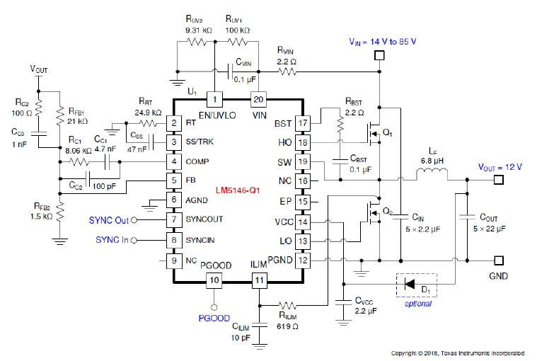
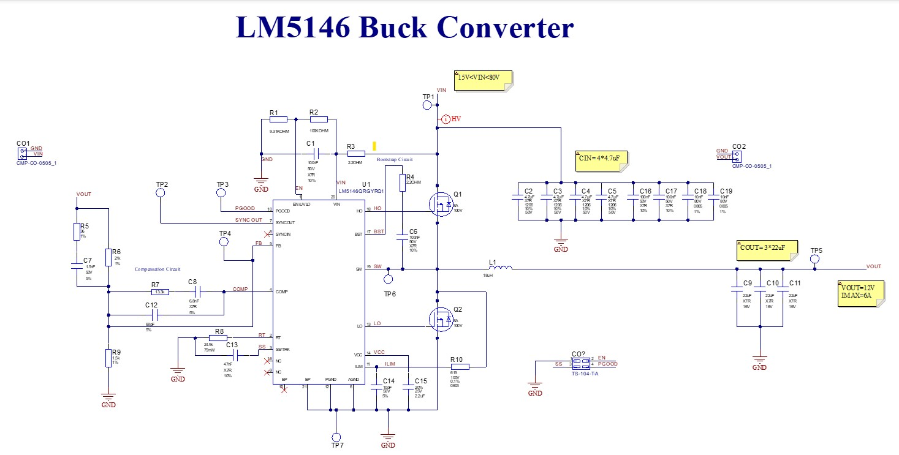
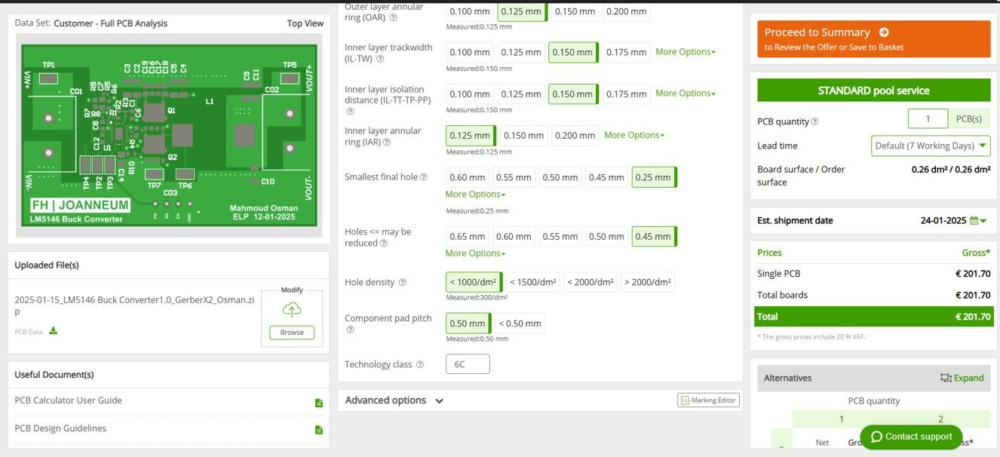
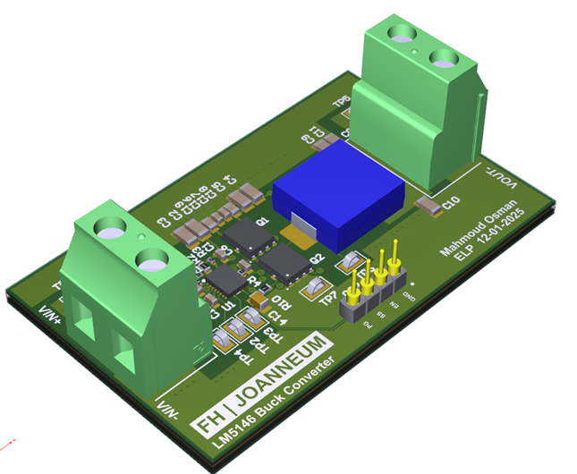

# LM5146 Buck Converter PCB Design Documentation   
**Author:** Mahmoud Esameldin Osman  
**Date:** 14.01.2025  

---

## Task Description

This laboratory task involves the complete design of a prototype Printed Circuit Board (PCB) of a DC-DC Buck converter evaluation module based on the **LM5146-Q1 controller IC**.  
The task includes schematic and layout design.  

### Design Specifications

| Specification | Description |
|----------------|-------------|
| Input voltage range | 15V – 80V |
| Typical input voltage | 48V |
| Output voltage | 12V |
| Maximum output current | 6A |
| Efficiency | 96% |
| Switching frequency | 400kHz |

---

## Calculations

To correctly implement the schematic, the **Application Circuit 2** from the LM5146-Q1 datasheet was used as a guide. MATLAB was used for the calculations.

### Inductor

**Equation 1:**  
`L_F = (V_OUT / V_IN) × ((V_IN - V_OUT) / (f_sw × ΔI_L))`

**Given:**
- V_IN = 48 V  
- V_OUT = 12 V  
- f_sw = 400 kHz  
- I_MAX = 6 A  
- ΔI_L = 0.2 × I_MAX  

**Result:**  
`L_F = 18 µH`

---

### Output Capacitor (COUT)

**Equation 2:**  
`C_OUT = ΔI_L / (8 × f_sw × (ΔV_OUT)²)`

**Given:**  
- ΔV_OUT = 0.01 × V_OUT  

**Result:**  
`C_OUT = 3.12 µF`

Because the ceramic capacitor ESR is negligible, it was ignored.  
To meet the ripple specification (2 % of max output current), a higher value was selected:  
**COUT = 3 × 22 µF**

---

### Input Capacitor (CIN)

**Equation 3:**  
`C_IN = (D × (1 – D) × I_MAX) / (f_sw × ΔV_IN)`

**Given:**  
- D = 0.5  
- ΔV_IN = 0.01 × V_IN  

**Result:**  
`C_IN = 7.81 µF`

**Used components:**  
- 4 × 4.7 µF  
- 2 × 10 nF  
- 2 × 100 nF (decoupling capacitors)  

All capacitors are **X7R** rated to provide low impedance and high RMS current rating over a wide temperature range.

---

### Other Components

Using TI’s **Quickstart Design Calculator**, values of *RUV1* and *RUV2* were selected.  

- **RRT = 24.9 kΩ** for 400 kHz switching frequency (per datasheet Table 8-1).  
- Added a **2.2 Ω resistor** in series with the boot capacitor to reduce voltage ringing and peak amplitude at the SW node.

---

## Schematic Design

The schematic uses **EN-60617** standard circuit symbols.  
Seven test points were added for measurement and debugging.

| Test Point | Net Label |
|-------------|------------|
| TP1 | VIN |
| TP2 | SYNC OUT |
| TP3 | PGOOD |
| TP4 | FB |
| TP5 | VOUT |
| TP6 | SW |
| TP7 | GND |

### Application Circuit

---

## Layout Design

The PCB layout is based on the LM5146-Q1 datasheet guidelines, using **copper-filled polygon areas** for power routing and **tracks for signals**.

- **Minimum clearance:** 0.6 mm for HV nets, 0.15 mm for others (per IPC-2221B).  
- **Layer stack-up:** 8 layers (chosen for lower production cost at Eurocircuits).

### Polygon Pours

| Layer | Polygon Pour Nets |
|--------|------------------|
| 1 | Signals and Power (GND, VIN, VOUT) |
| 2 | Power (GND) |
| 3 | Power (VIN) |
| 4 | Power (GND) |
| 5 | Power (VOUT) |
| 6 | Power (GND) |
| 7 | Power (GND) |
| 8 | Signals and Power (GND) |

### Schematic Desgin:

---

## Price Analysis

Using **Eurocircuits PCB manufacturer** pricing tool:  
- **Board size:** 65 mm × 40 mm  
- **Cost estimate:** €201.70 for one board  

---

## 3D PCB Views

The final PCB visualized in 3D:

---

## References

1. [LM5146 Datasheet](https://www.ti.com/lit/ds/symlink/lm5146.pdf)  
2. [LM5146DESIGN-CALC Tool | TI.com](https://www.ti.com/tool/LM5146DESIGN-CALC)  
3. [Liste der Schaltzeichen (Elektrik/Elektronik) – Wikipedia](https://de.wikipedia.org/wiki/Liste_der_Schaltzeichen_(Elektrik/Elektronik))  
4. [Using an IPC-2221 PCB Clearance Calculator for High Voltage Design – Altium](https://resources.altium.com/p/using-an-ipc-2221-calculator-for-high-voltage-design)  
5. [Eurocircuits PCB Manufacturer](https://www.eurocircuits.com)  
